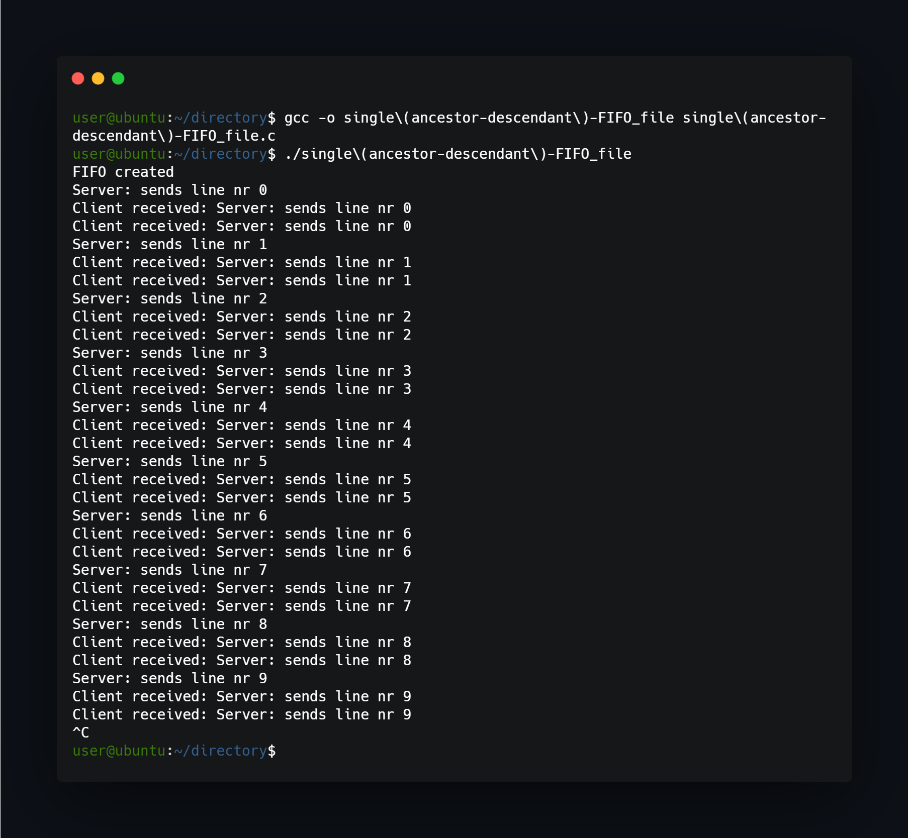

## What project do?
Programs act like single(ancestor-descendant)-FIFO_file and client that communicate through FIFO file method.



## How to use?
Just compile and run:
```
gcc -o single(ancestor-descendant)-FIFO_file single(ancestor-descendant)-FIFO_file.c
./single(ancestor-descendant)-FIFO_file
```

## Possible problems
While running program multiple times can occur problem with FIFO file, then file becomes unresponsive to writing/reading (because it was created by other program instance). Then deleting myfifo file form /tmp/myfifo will help, because program creates new file with every execution.


<!--https://banner.godori.dev/ height:150-->
<!--https://shields.io/-->
<!--https://carbon.now.sh/-->